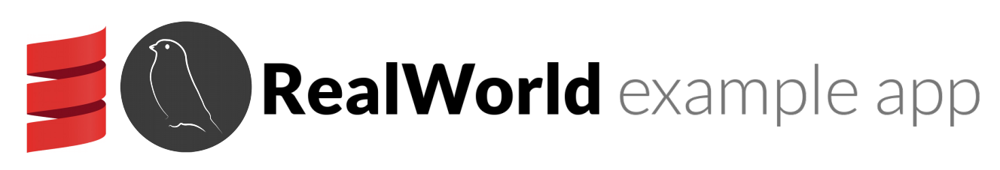

# 

> ### Scala & Finch codebase containing real world examples (CRUD, auth, advanced patterns, etc) that adheres to the [RealWorld](https://github.com/gothinkster/realworld) spec and API.

### [Referential demo](https://react-redux.realworld.io/)

This codebase was created to demonstrate a fully fledged fullstack application built with **Scala & Finch** including CRUD operations, authentication, routing, pagination, and more.

For more information on how to this works with other frontends/backends, head over to the [RealWorld](https://github.com/gothinkster/realworld) repo.

# Getting started

## You need installed:
 * Java 8,
 * sbt.

Then:
 * sbt test -- to run tests,
 * sbt run -- to run server in dev mode.

======

Feel free to comment and improve current implementation!

